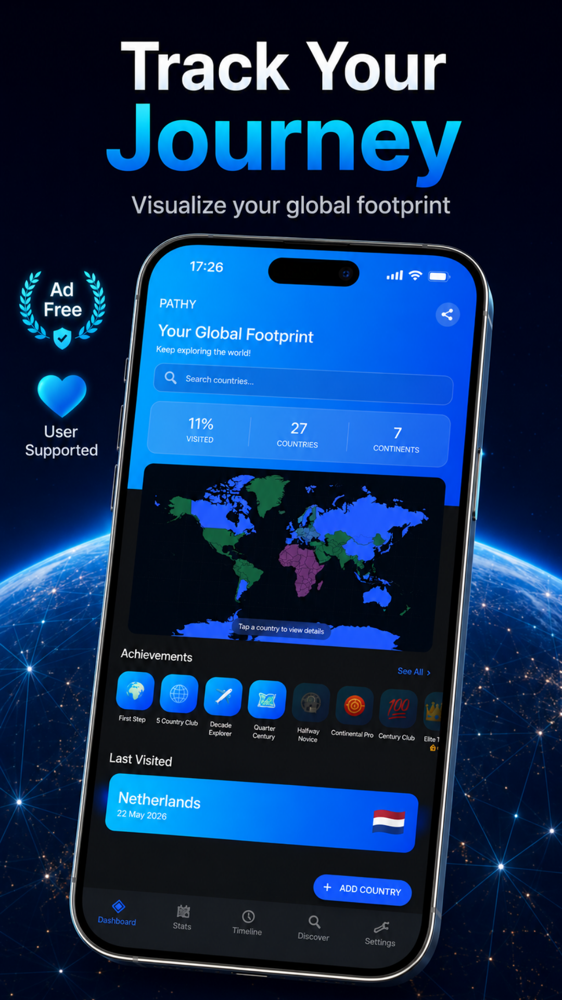
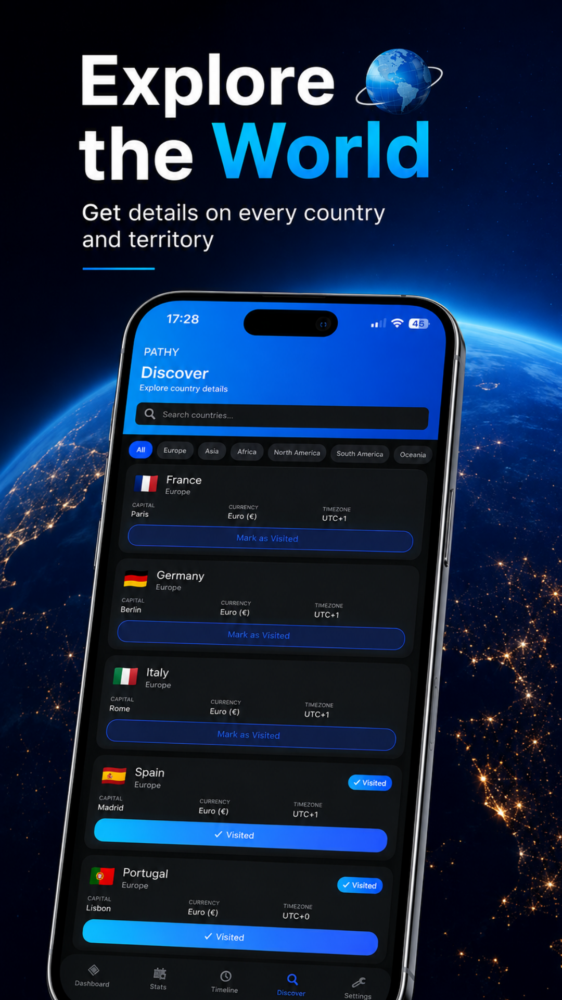
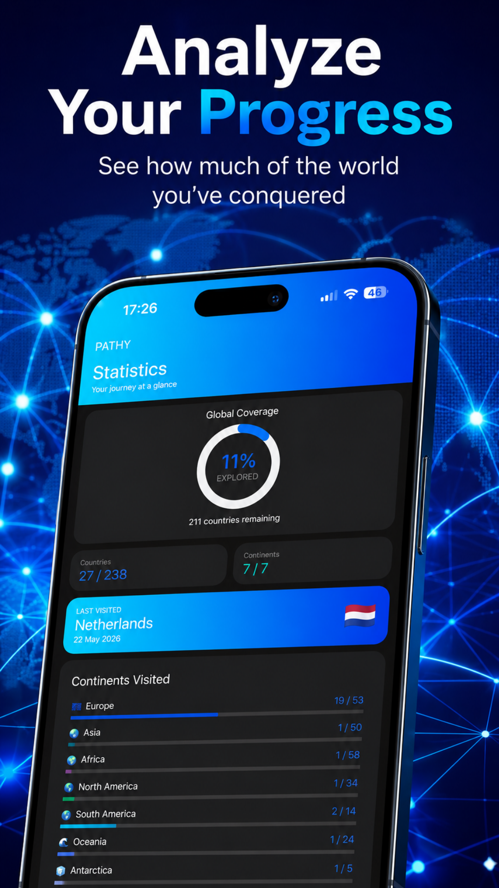
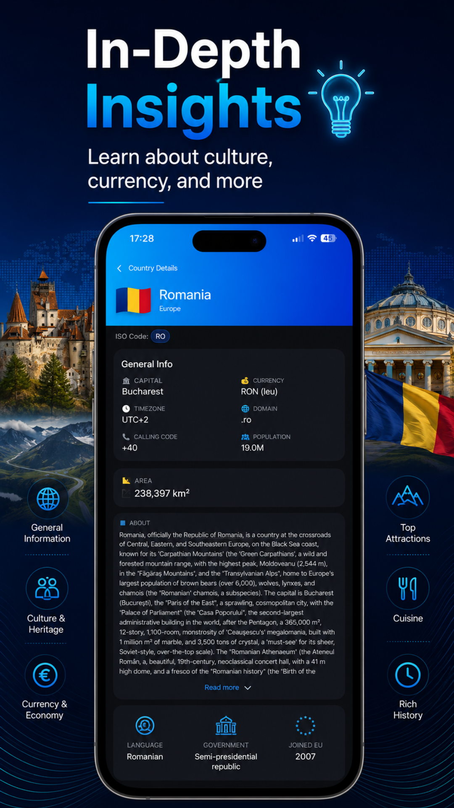
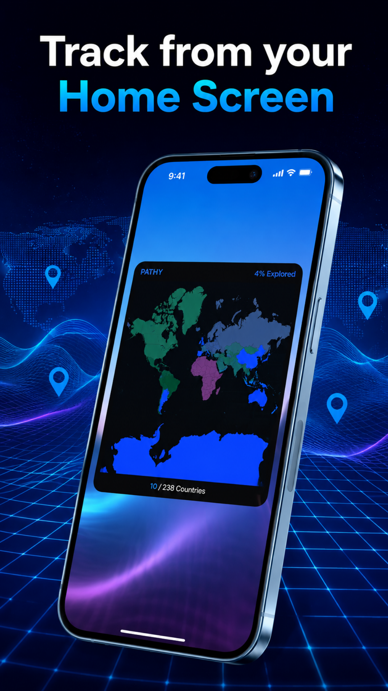

# 🌍 PATHY — Country Travel Tracker

### A private, offline map of the countries you have explored.

## Screenshots

---

## About

PATHY is an offline-first travel tracker with an interactive world map, continent statistics, travel dates, achievements, a home-screen widget and optional private travel notes. It does not request GPS location.

## Features

- Track all 195 visited countries
- Interactive, color-coded world map
- Statistics across all seven continents
- Travel timeline and multiple visit dates
- Explorer achievements and milestones
- Premium private travel notes
- Default, Vintage, Cyberpunk and Forest map themes
- Home-screen map widget and eligible launcher icons
- No GPS tracking, analytics or advertising

## Optional Purchases

| Product | Type | Main benefit |
|---|---|---|
| Basic Support | One-time | Removes developer-support prompts and unlocks the Supporter badge. |
| Monthly Supporter | Subscription | Removes prompts and provides the VIP Supporter badge and eligible launcher icons while active. |
| Premium Lifetime | One-time | Unlocks private travel notes, custom map themes, all eligible launcher icons, removes prompts and provides the Ultimate Legend badge. |

Prices, currencies, trial eligibility and current benefits are shown by Google Play before purchase. Subscriptions renew until cancelled through Google Play.

## Privacy

- No third-party advertising SDKs
- No behavioral advertising or advertising profiling
- No app account required for core use
- App content stays local whenever possible
- Google Play and RevenueCat process only the purchase information needed for optional products

Read the complete [Privacy Policy](./PRIVACY_POLICY.md).

## Download

**Google Play:** [https://play.google.com/store/apps/details?id=com.pathydc](https://play.google.com/store/apps/details?id=com.pathydc)

## Documentation

| Document | Purpose |
|---|---|
| [Privacy Policy](./PRIVACY_POLICY.md) | Information handling and user rights |
| [Terms of Use](./TERMS_OF_SERVICE.md) | Rules, billing and app-specific limitations |
| [License](./LICENSE) | Proprietary software licence |
| [Security Policy](./SECURITY.md) | Responsible vulnerability reporting |
| [Support](./SUPPORT.md) | Help and troubleshooting |
| [Changelog](./CHANGELOG.md) | Notable app changes |
| [Contributing](./CONTRIBUTING.md) | Bug reports and feature suggestions |

## Developer

**Denis Casian** — Independent developer, Romania

- Website: [deniscasian.com](https://deniscasian.com/)
- Support: [support@deniscasian.com](mailto:support@deniscasian.com)
- Bug reports: [bugs.deniscasian.com](https://bugs.deniscasian.com/)

---

[PATHY on Google Play](https://play.google.com/store/apps/details?id=com.pathydc) · [Privacy](./PRIVACY_POLICY.md) · [Terms](./TERMS_OF_SERVICE.md)

*© 2026 PATHY. All rights reserved.*

