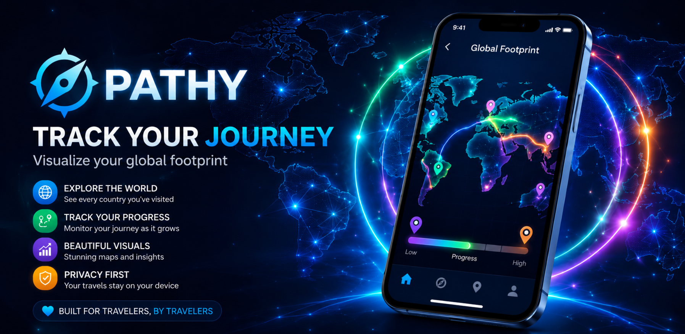
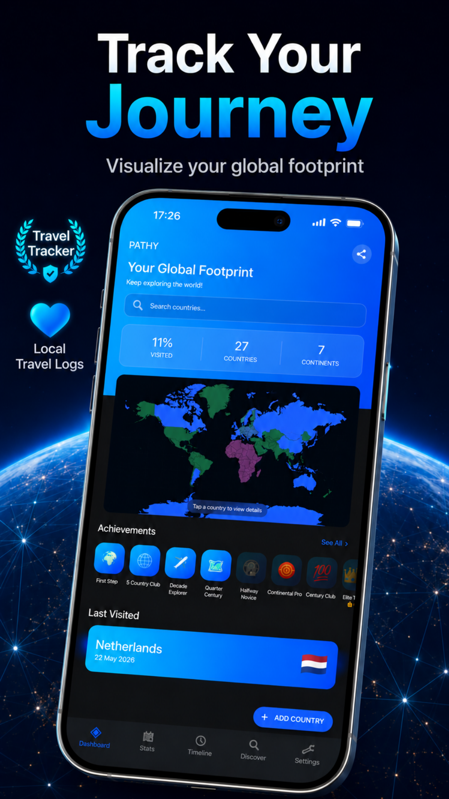
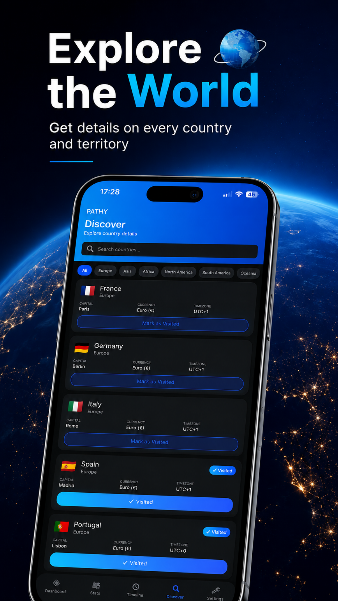
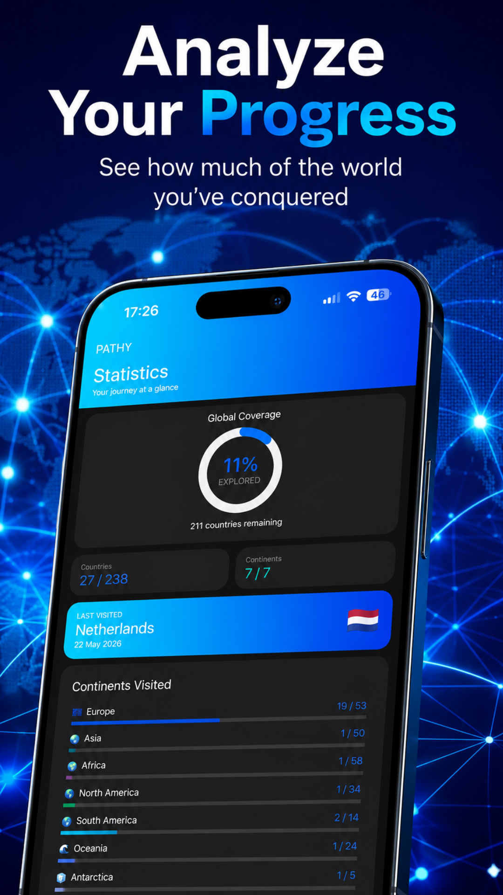
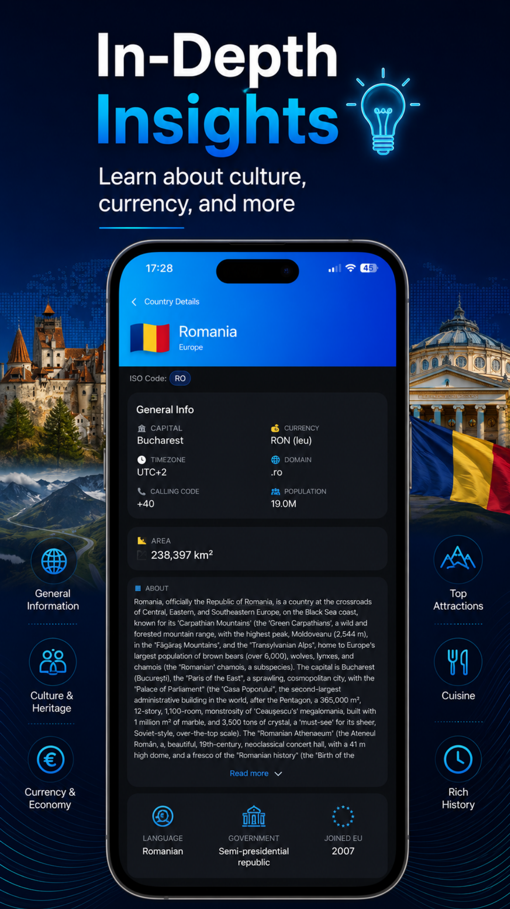
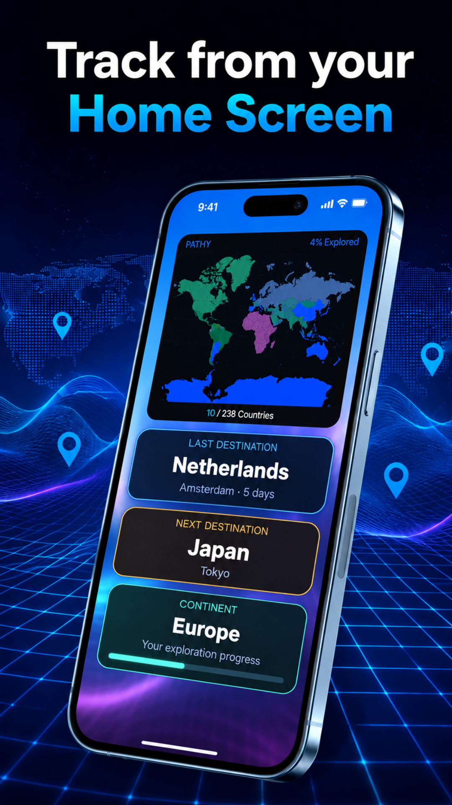
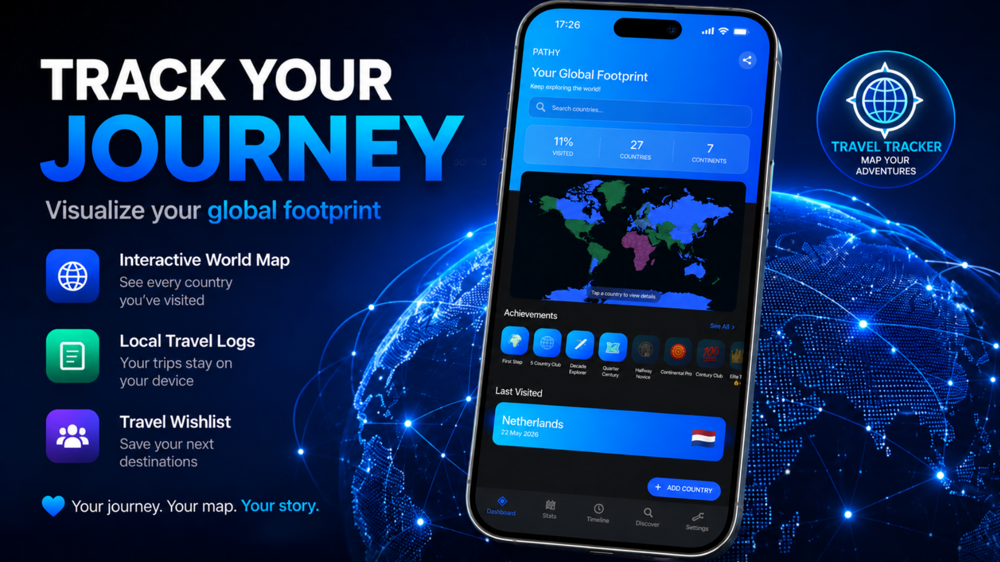
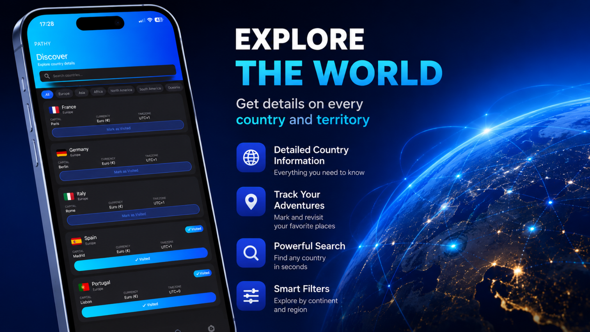
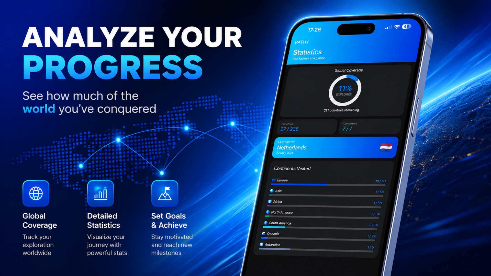
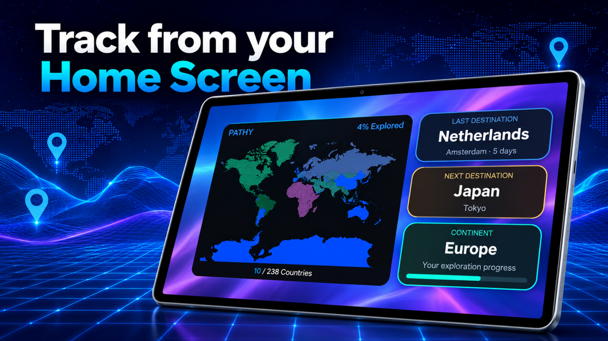

# 🗺️ PATHY

### Country Travel Tracker, World Map & Travel Journal

**Your personal travel map for every journey.**  
Clean. Offline-first. Free with optional ad-free Supporter tiers.

 

---

---

## 🗺️ About PATHY

**PATHY** is an offline-first travel tracker for Android.
Mark the countries you have explored, record multiple visits with dates and cities,
and see your journeys on an interactive world map. Follow your continent
statistics, unlock achievements, and keep private travel notes with Premium Lifetime.

Your travel records stay on your device. No PATHY account or GPS tracking is required.

> ### 🔔 Free App — Supported by Advertising
> PATHY contains **Google AdMob** banner, native, interstitial, and app-open ads.  
> **Supporter** removes advertising while its one-time entitlement remains valid.  
> **Monthly Supporter** removes advertising for the active subscription period.  
> **Premium Lifetime unlocks features and still includes ads.** It does not grant ownership of the Supporter products.

---

## ✨ Features

### 🌍 Interactive World Map
- Pinch to zoom and drag to explore
- Continent labels at the initial overview
- Country labels become visible as you zoom and space becomes available
- Color-coded countries and visited-country highlighting
- **239 countries and territories** in the app's country list

### 📍 Countries, Cities & Repeat Visits
- Mark countries as visited
- Record **multiple visits** to the same country
- Choose a visit date and enter the city or area in the same themed dialog
- Country-specific city suggestions from a **local GeoNames dataset**
- Add another visit, edit a visit, or remove visits

> Suggestions cover cities in the bundled dataset; smaller places can be typed manually.

### 📊 Statistics & Achievements
- Global exploration percentage
- Progress across all seven continents
- Country milestones and explorer achievements
- A personal timeline with individual visit dates and places

### 📱 Home Screen Widget

| Widget | Description |
|---|---|
| **Travel map** | Your world map, exploration percentage, and visited-country count |

The widget supports resizing, reflects visited countries, and uses your eligible
selected map theme. Preview resources are provided for modern and older Android launchers.

### 📝 Additional Features
- **Private travel notes** with Premium Lifetime
- **Map themes**: Default, Vintage, Cyber, and Forest
- **Custom launcher icons** for eligible paid tiers
- **Offline travel tracking** with no GPS permission
- **Local storage** with no PATHY cloud account or backup

---

## 👑 Premium Features

| Feature | Free | Premium Lifetime |
|---|:---:|:---:|
| Visited countries and interactive world map | ✅ | ✅ |
| Multiple visits, dates and city suggestions | ✅ | ✅ |
| Timeline, statistics and achievements | ✅ | ✅ |
| Home-screen map widget | ✅ | ✅ |
| **Private travel notes** | ❌ | ✅ |
| **Custom map and widget themes** | ❌ | ✅ |
| **Custom launcher icons** | ❌ | ✅ |
| **Ultimate Legend badge** | ❌ | ✅ |
| **Remove advertising** | Separate Supporter purchase | Separate Supporter purchase |

Custom launcher icons are also available to active Monthly Supporter subscribers.

---

## 💳 Pricing

PATHY is **free** and supported by Google AdMob advertising.  
All paid tiers are optional. Current local prices are displayed in the app by Google Play.

### One-Time Purchases

| Product | Price | Description |
|---|:---:|---|
| 🏆 **PATHY Premium Lifetime** | Shown in app | Permanent advertised premium features, travel notes, map themes, icons and Ultimate Legend badge. **Ads are still shown.** |
| ❤️ **PATHY Supporter / Remove Ads** | Shown in app | **Removes all advertising** while the one-time entitlement remains valid. Supporter badge. |

### Subscriptions

| Product | Price | Benefits |
|---|:---:|---|
| 💎 **Monthly Supporter** | Shown in app | **Removes all advertising while active**, VIP Supporter badge and custom launcher icons |

PATHY does not currently offer a Premium Monthly subscription.

> Refunds, entitlement revocations, or Monthly Supporter expiry can restore ads
> after purchase status is synchronized. Cancelling renewal normally keeps
> subscription benefits until the paid period ends.

---

## 🛡️ Privacy

PATHY keeps your **personal travel records on your device:**

| | |
|---|---|
| ✅ | Visited countries, dates, cities and journal notes remain local |
| ❌ | No GPS or background location tracking |
| ❌ | No PATHY account or travel-data cloud backup |
| 🔔 | Google AdMob advertising for users without an active ad-removal entitlement |
| ✅ | Google UMP manages required consent messages and available ad privacy choices |
| ✅ | Supporter and active Monthly Supporter remove third-party in-app advertising |
| ℹ️ | Ad services may process IP addresses, identifiers, interactions and diagnostics |
| ✅ | Purchases verified through Google Play and RevenueCat |

Available advertising consent choices can be revisited in **Settings → Ad privacy choices**
while advertising is enabled. Refusing personalization does not necessarily remove all ads.
Private travel records are not provided to AdMob.

> Uninstalling PATHY, clearing app data, or resetting your device can permanently
> delete your travel records. Android backup is disabled; the developer cannot restore them.

→ **[Full Privacy Policy](./PRIVACY_POLICY.md)**

---

## 🔗 Download

**[PATHY on Google Play](https://play.google.com/store/apps/details?id=com.pathydc)**

---

## 🌍 Map & City Data Attribution

Country geometries use the bundled **Natural Earth** map dataset
([public domain](https://www.naturalearthdata.com/about/terms-of-use/)).

City suggestions use **[GeoNames](https://www.geonames.org/)** cities15000 data,
licensed under **[CC BY 4.0](https://creativecommons.org/licenses/by/4.0/)**.
Attribution: © GeoNames.

---

## 📄 Legal Documents

| Document | Description |
|---|---|
| [Privacy Policy](./PRIVACY_POLICY.md) | Local data, advertising, consent and purchases |
| [Terms of Use](./TERMS_OF_SERVICE.md) | Rules for using PATHY |
| [License](./LICENSE) | Proprietary software license |
| [Security Policy](./SECURITY.md) | How to report vulnerabilities |
| [Changelog](./CHANGELOG.md) | Version history |
| [Support](./SUPPORT.md) | Help and contact information |

---

## 📸 Tablet 

Tablet screenshots

 

  
  

---

## 👤 Developer

**Denis Casian** — Independent developer, Romania 🇷🇴

| | |
|---|---|
| 🌐 Website | [rdcapps.com](https://rdcapps.com) |
| 📧 Support | [support@rdcapps.com](mailto:support@rdcapps.com) |
| 🐛 Bug Reports | [bugs.rdcapps.com](https://bugs.rdcapps.com) |
| 📱 App | [PATHY on Google Play](https://play.google.com/store/apps/details?id=com.pathydc) |

---

Made with ❤️ for explorers around the world.

**[Download PATHY](https://play.google.com/store/apps/details?id=com.pathydc)** ·
**[Privacy Policy](./PRIVACY_POLICY.md)** ·
**[Terms of Use](./TERMS_OF_SERVICE.md)**

*© 2026 PATHY. All rights reserved.*

